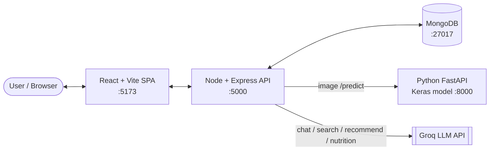
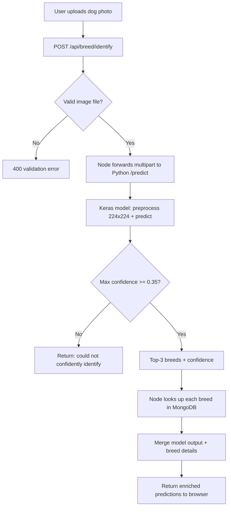
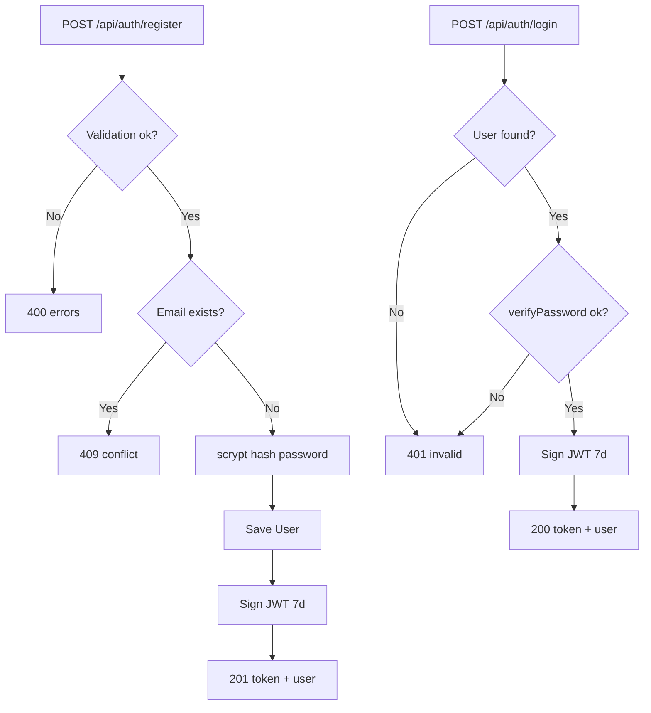
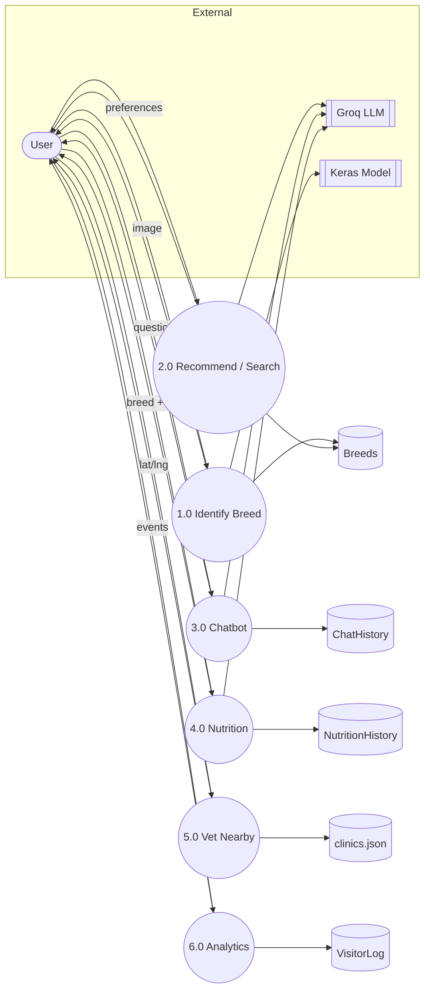
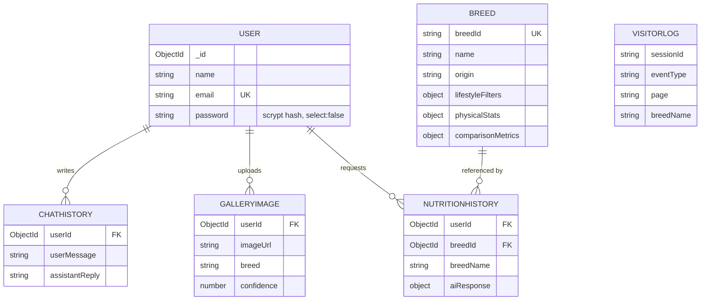

# Diagrams — PawIntel AI

Flowcharts, Data Flow Diagram (DFD), and Entity-Relationship Diagram (ERD) for the
project report. Rendered with Mermaid (GitHub renders these natively).

---

## 1. System Architecture

---

## 2. Breed Identification — Flowchart

---

## 3. Authentication — Flowchart

---

## 4. Data Flow Diagram (DFD — Level 1)

---

## 5. Database ERD

> `VISITORLOG` is keyed by anonymous `sessionId` (no user FK). See [database.md](./database.md).
